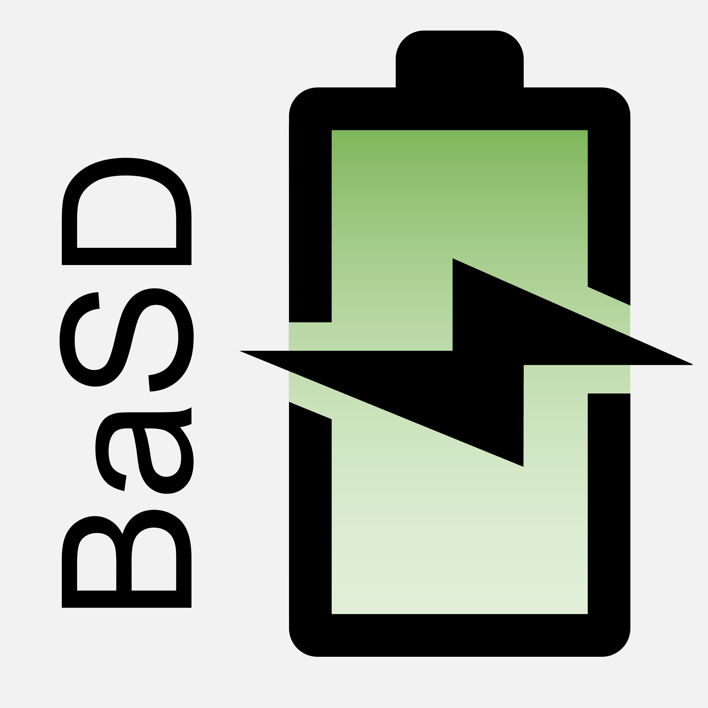
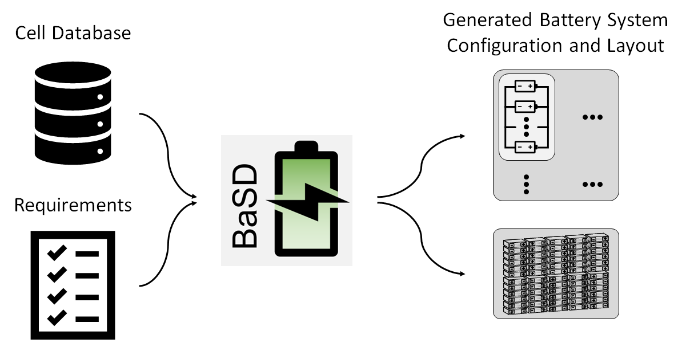

<table>
    <tbody>
        <tr>
        <td><h1>Battery System Designer (BaSD)</h1></td>
            <td rowspan=4> </td>
        </tr>
    </tbody>
</table>

    Automated, requirements driven battery system design

``BaSD`` uses the basic, formalized requirements for a battery system from an
electrical point of view (e.g., minimum and maximum system voltage, maximum
discharge current etc.) and a mechanical point of view (i.e., the design space)
and transfers this into a battery system configuration that satisfies these
requirements.
``BaSD`` uses a database of available cells to find these possible battery
system configurations.



Workflow of the ``BaSD`` tool to automatically create a battery system
configuration, layout and simplified CAD model

## User Installation

The latest release can be installed via pip from [PyPi](https://pypi.org/project/basd):

```bash
$ pip install basd
```

The latest development version can be installed via pip:

```bash
$ pip install git+https://github.com/BaSD-Project/BaSD
```

## Acknowledgment

| This work was financially supported by the Federal Ministry of Education and Research within the projects FKZ: 03XP0338C ("SimBAS"). The project is cared by Project Management Jülich. The responsibility for this publication rests with the authors. |  |
|---------------------------------------------------------------------------------------------------------------------------------------------------------------------------------------------------------------------------------------------------------|-------------------------------------------------------------------------------------------------------------------------------------------------------------------------------------------------------------------------------------------------------------------------------------|
