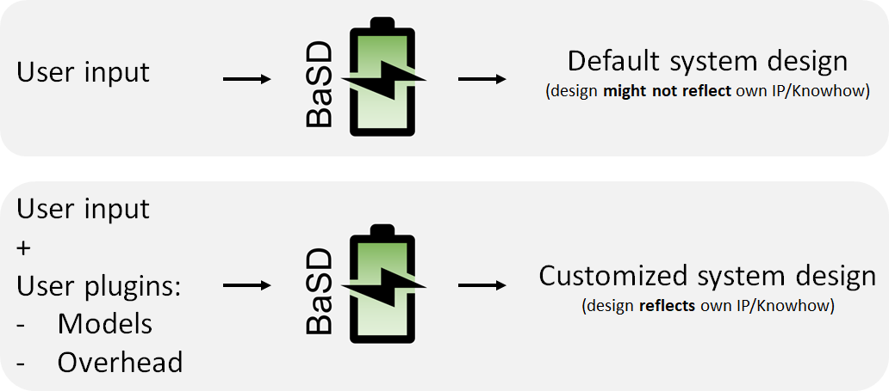

.. include:: ./../macros.txt

Rationale
=========

The |basd-tool| uses two backends to design and validate the battery system it
creates:

- an overhead estimation for the mechanical overhead that is generated by e.g.,
  electrical connection of the batteries, cooling system, materials to be used
  etc., and most important the know-how of the design team, that afterwards
  will fully design the battery system.
- models for the lifetime simulation

These two backends can be customized via command line arguments.
These backends need to be installed in the same python
installation/environment and need to implement the respective API.
The APIs are explained for the overhead functionality
:ref:`here <OVERHEAD_COMPUTATION>` and for battery model customization
:ref:`here <BATTERY_MODELS>`.

