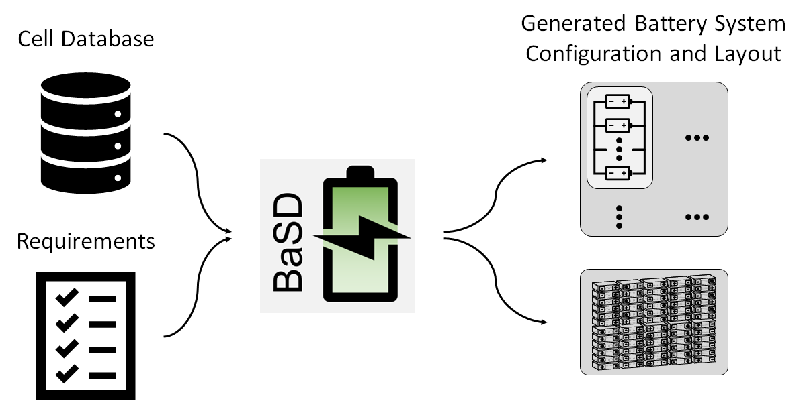

.. include:: ./macros.txt

Battery System Designer (``BaSD``)
==================================

    Automated, requirements driven battery system design

The Battery System Designer (``BaSD``) tool is tool to support the design
process, layout and optimization of battery systems during development.

``BaSD`` uses the basic, formalized requirements for a battery system from an
electrical point of view (e.g., minimum and maximum system voltage, maximum
discharge current etc.) and a mechanical point of view (i.e., the design space)
and transfers this into a battery system configuration that satisfies these
requirements.
``BaSD`` uses a database of available cells to find these possible battery
system configurations.

   Workflow of the ``BaSD`` tool to automatically create a battery system
   configuration, layout and simplified CAD model

The following documentation describes how to use and extend |basd|.

.. |logo_fkz| image:: ./_static/bmbf.png

.. note::

   |basd| is licensed under the :ref:`MIT license <LICENSE>`.

.. note::

   +-------------------------------------+------------------------------------+
   | This work was financially supported | |logo_fkz|                         |
   | by the Federal Ministry of          |                                    |
   | Education Research within the       |                                    |
   | projects FKZ: 03XP0338C ("SimBAS"). |                                    |
   | The project is cared by Project     |                                    |
   | Management Jülich.                  |                                    |
   | The responsibility for this         |                                    |
   | publication rests with the authors. |                                    |
   +-------------------------------------+------------------------------------+

.. toctree::
   :maxdepth: 1
   :caption: User Guide

   introduction.rst
   usage_and_configuration/getting_started.rst
   usage_and_configuration/usage.rst
   usage_and_configuration/example.rst

.. toctree::
   :maxdepth: 1
   :caption: Customization

   customization/rationale.rst
   customization/overhead.rst
   customization/modelling.rst

.. toctree::
   :maxdepth: 1
   :caption: Theoretical Approach

   approach/mechanical-overhead.rst
   approach/optimization-problem.rst

.. toctree::
   :maxdepth: 1
   :caption: Development

   development/dev-installation.rst
   development/changelog.rst
   development/unit-tests.rst
   development/contributing.rst
   architecture/architecture.rst
   development/api/api.rst

.. toctree::
   :maxdepth: 1
   :caption: Project Links

   license.rst
   GitHub <https://github.com/foxBMS/BaSD>
   Documentation <https://basd.readthedocs.io>
   acknowledgment.rst

Indices and tables

* :ref:`genindex`
* :ref:`modindex`
* :ref:`search`
