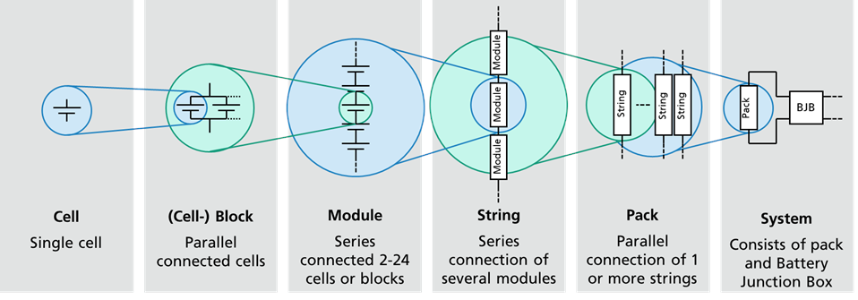

.. include:: ./macros.txt

############
Introduction
############

Naming Conventions
##################

The BaSD tool follows the `Naming Convention`_ of the `foxBMS project`_
developed by the `Fraunhofer IISB`_.

         defined by the foxBMS project)

   Naming conventions for battery system elements (as defined by the `foxBMS project`_)

- A battery cell or cell is the smallest unit in a battery system.
  It has one positive terminal and one negative terminal.
- Battery cells are usually connected in parallel to enhance the current
  capability of the system.
- Battery cells connected in parallel form a (cell-)block.
- Cells or cell blocks put in series form a battery module.
- Several modules connected in series form a string.
- Several strings connected in parallel form a battery pack.
- The highest unit is the battery system.
  It is formed by the conjunction of a battery pack and a battery junction box
  (BJB). The BJB contains the elements used to control the current flow like
  power contactors and fuses.

Battery System Generation
#########################

The battery systems are generated based on the requirements definition and the
battery cells that are available for this task.
To do this calculation, the |basd-tool| uses a knowledge base containing the
information of how much overhead a typical system design the e.g., a liquid
cooled battery system consisting of cylindrical cells creates.

The |basd-tool| then generates a report with the battery system configurations
it has found.
This report then includes the configuration. e.g.,

- 10 cells in parallel per cell block
- 15 cells in series per module
- 5 modules in series per string
- 2 strings in parallel per pack

based on some cell.

Further the |basd-tool| can create a CAD design of the system to get a first
impression how the system looks like.

Inputs
######

As already stated, |basd| needs requirements the battery system needs to
fulfill (i.e., the requirements file) and a cells that can be used for the
simulation (i.e., the cell database).

.. _INTRO_REQUIREMENTS:

Requirements
============

.. note::

   All requirements need to be defined in basic SI unit or units derived from
   them without any prefixes (e.g., to define a voltage of **1000V** use
   the value ``1000`` instead of ``1k``)

Requirements are defined by a ``json`` file that is passed to |basd| as
argument.
The file needs to define the following aspects of the battery system:

- ``system``: General system requirements.
  All settings here are **optional**.
  The default values are described below.

  - ``optimized_by``: determines the overall optimization goal (either
    ``volume`` or ``weight``, default: ``volume``)
  - ``cooling``: type of cooling that should be considered (one of ``AIR``,
    ``GLYCOL``, ``REFRIGERANT``, default: ``TODO``)
  - ``cell``: consider only a reduced set of cells:

    - ``manufacturer``: only from this manufacturer
    - ``model``: only these model
    - ``format``: only cells with the specified format

- ``electrical``: Key for all electrical requirements:

  - ``energy``: minimum energy content (in ``Wh``)
  - ``voltage``: voltage limits:

    - ``minimum``: minimum voltage (in ``V``)
    - ``maximum``: maximum voltage (in ``V``)
    - ``nominal``: (desired) nominal voltage (in ``V``)

  - ``continuous maximum``: continuous maximum requirements:

    - ``charge``: in charge direction:

      - ``power``: power  (in ``W``)

    - ``discharge``: in discharge direction:

      - ``power``: power  (in ``W``)

  - ``maximum module voltage``: maximum module voltage a module shall not
    exceed (in ``V``)

- ``slave``: BMS Slave requirements:

  - ``minimum``: minimum number of cells per slaves (dimensionless)
  - ``maximum``: maximum number of cells per slaves (dimensionless)
  - ``equal utilization``: determines whether all slaves on a module shall be
    equally utilized (e.g., if a module uses two slaves, both slaves measure
    the same number of cells)

- ``mechanical``: mechanical requirements:

  - ``weight``: maximum weight of the system (in ``kg``)
  - ``width``: maximum width of the system (in ``m``)
  - ``height``: maximum height of the system (in ``m``)
  - ``length``: maximum length of the system (in ``m``)

An exemplary requirements file could look like this:

.. literalinclude:: ../tests/requirements/dummy-system.json
   :language: json
   :caption: Exemplary requirements file for the battery system design

.. _CELL_DATABASE:

Cell Database
=============

.. note::

   All cell parameters need to be defined in basic SI unit or units derived
   from them without any prefixes (e.g., to define a length of **1mm** use
   the value ``0.001`` instead of ``1mm``)

The |basd-tool| needs cell to calculate battery systems.
These cells are defined in a human read- and editable database that consists of
``json`` files.
The database is installed into the users home directory (dependent on the
operating system).
A battery cell needs to define the following aspects of the battery cell:

- ``identification``: unique identification of the cell battery cell:

  - ``manufacturer``: manufacturer of the battery cell (arbitrary string)
  - ``model``: model of the battery cell (arbitrary string)

- ``basic``: basic information on the battery cell (mechanical and electrical
  parameters)

  - ``mechanics``: mechanical parameters:

    - ``weight``: cell weight (in ``kg``)
    - ``format``: cell format (``Cylindrical``, ``Prismatic`` or ``Pouch``)
    - (optional) ``standard``: whether the cell format adheres to a known cell format
      standard (arbitrary string)
    - ``dimensions``: cell dimensions:
      - ``height``: cell height (in ``m``)
      - ``length``: cell length (in ``m``)
      - ``width``: cell width (in ``m``)

  - ``electrics``: electrical parameters:

    - ``energy`` content

      - ``nominal``: nominal energy content (in ``Wh``)
      - ``minimum``: minimum energy content (in ``Wh``)

    - ``voltage``: cell voltage

      - ``nominal``: nominal cell voltage (in ``V``)
      - ``maximum``: maximum cell voltage (in ``V``)
      - ``minimum``: minimum cell voltage (in ``V``)

    - ``current``: current limits

      - ``charge``: current limit in charge direction (in ``A``)
      - ``discharge``: current limit in discharge direction (in ``A``)

    - ``capacity``: battery capacity

      - ``initial``: battery capacity at the BOL (in ``Ah``)

    - ``discharge curve``: a list of voltages reflecting the discharge curve from
      100% SOC to 0%.

An exemplary cell file could look like this:

.. warning::

  The OCV curve is shortened for simplify the introduction.
  A real cell the OCV curve actually needs a list with 101 entries (for every
  SOC point from 0% to 100% SOC).

.. literalinclude:: ../tests/cells/dummy_cell.json
   :language: json
   :caption: Minimum information of a cell from the database
